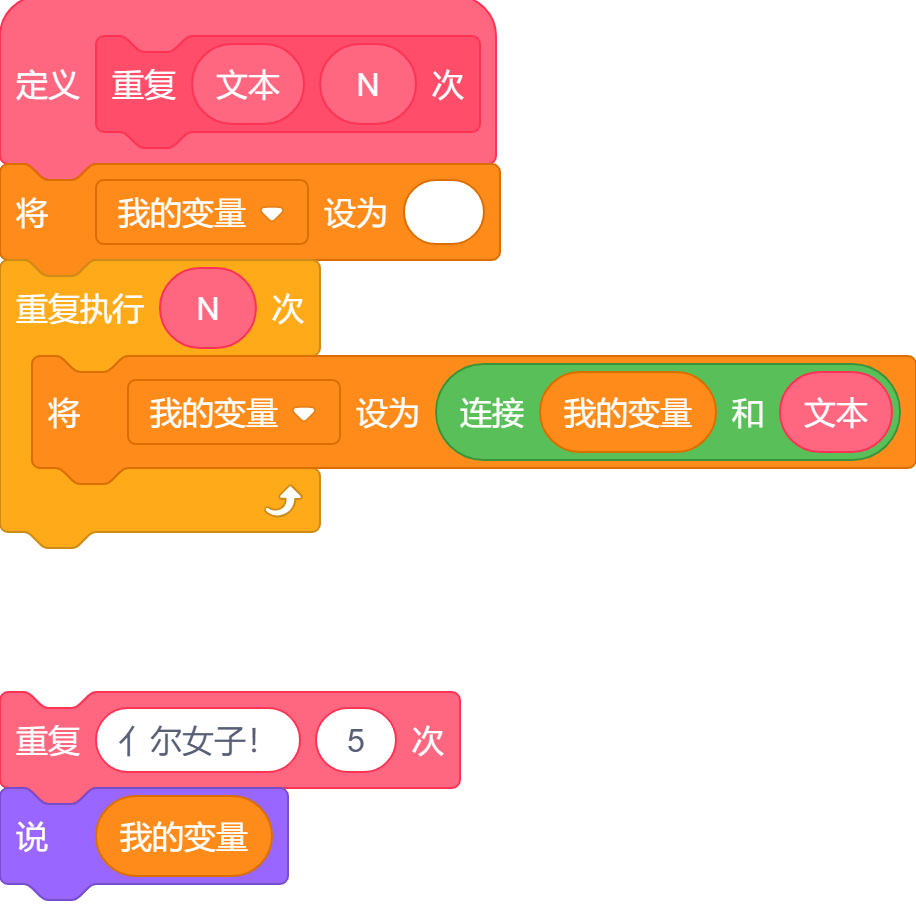
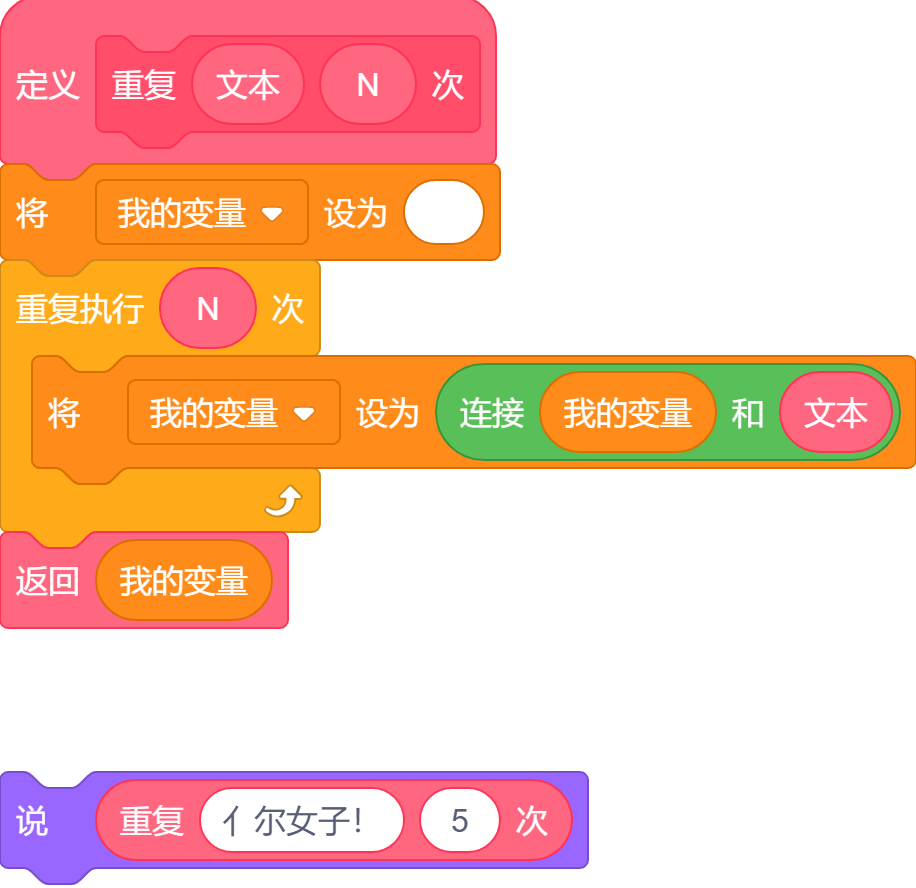
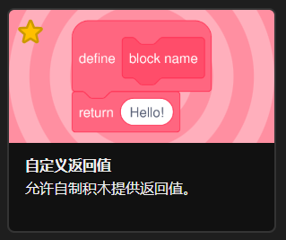

# 自定义返回值

TurboWarp 提供了自定义返回值，这意味着您可以将作品中的任何块（例如 Scratch 中内置的添加块）用作返回值。这在基于文本的编程语言中是一项相当常见的功能，但对于各位 Scratcher 可能难以理解。

!!! warning "注意啦！"
    使用此功能的作品无法上传至 Scratch 网站。

自定义返回值从技术层面上讲，并不会赋予您比以往更多的功能——它们只是让阅读和编写变得*更加*便捷而已。例如，如果您的作品需要大量重复使用某些文本，您可以创建这样的代码：

{width=436.5}

这种方法可行，但是十分丑陋，而且随着你使用该块的次数增多，还会更<s>几把</s>乱。通过使用返回块来创建自定义返回值，情况就会变得简单得多：

{width=436.5}

## 怎么用？ {#usage}

点击编辑器左下角的按钮（与“画笔”等扩展所在位置相同）来打开扩展库，然后启用“自定义返回值”：

然后，像平常一样创建一个自定义块。要创建一个自定义返回值，只需将一个“返回”块拖入脚本中——它一般位于自定义块列表的底部。您不需要勾选任何选项或进行任何切换。

一旦运行到返回块，就会停止这个脚本，类似于“终止此脚本”。

TurboWarp 会自动将块调整为正确的形状（虽然有时候会出错，很离谱你知道吧）。您可以通过右键点击某个块，然后选择“转换为命令积木”或“转换为返回值积木”来更改其形状。

当然，如果一个自定义块中的所有返回块都放入一个布尔值（真/假），例如“1 > 2”，这样该自定义块也将变成布尔值的形状，也就是一个六边形。这只是一个视觉上的辅助，因为任何自定义返回值都可以放入任何输入框中。

## 递归 {#recursion}

递归也是支持的。这一点可能有点难以理解，但说白了，就是函数自己调用自己。如果你能将一个大问题不断分解为更小的问题，直到达到一个非常基本的情况（就像你和原子一样），那么许多算法都可以被编写得非常简洁优雅。

通过递归，您可以在完全不使用任何变量的情况下将重复文本块重写：

{width=500px}

就像自定义返回值本身一样，递归并不会让你去做那些原本就不可能做到的事情，但它的确能更容易理解程序。（用循环实现的任何内容都可以改成递归，反之亦然。只是有些时候其中一种解决方案会比另一种更简单方便。）

!!! info "信息"
    在使用编译器时，请注意避免因递归操作过多而导致的[栈溢出错误](https://en.wikipedia.org/wiki/Stack_overflow)。通常递归调用超过几千次就会引发错误，这并不好笑孩子。

## 编译器和解释器有啥区别？ {#interpreter-compiler}

解释器支持无限递归，而编译器则受到 JavaScript 栈大小的限制，其大小通常约为几千次调用的深度，但不同系统和浏览器会有所差异。

!!! info "信息"
    建议确保带有自定义返回值的块仅运行某些算法并输出最终答案。为确保您的作品在编译器和解释器中运行效果一致，带有自定义返回值的块应避免诸如移动精灵、显示文字、等待等操作。

为了提升性能，编译器有一个名为[短路运算](https://en.wikipedia.org/wiki/Short-circuit_evaluation)的功能。想象一下这样一个 Scratch 块：“&lt; (1 = 2) 与 (3 = 3) &gt;”。当编译器遇到这个块时，它首先会计算“1 = 2”，这显然是错误的。在这种情况下，编译器甚至无需检查“与”块的另一侧，因为其结果不会有任何影响：最终结果始终为假。通常这只是节省性能，但如果您的块具有其他功能（例如移动角色），则会出现不同的行为，因为解释器会始终评估所有块。尝试执行这个脚本：

{width=482px}

如果您的自定义返回值深层嵌套在其他代码块内部，那么它们在编译器和解释器中的运行顺序可能不大相同。
