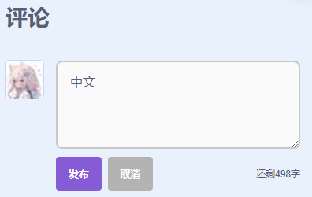

# 帮助翻译 TurboWarp

我们正在到处找人来帮我们把 TurboWarp 翻译成除了英语以外的其他语言。如果您对此感兴趣，请继续阅读。

## 基本条件 {#requirements}

 - 您必须**精通英语**，不是像 Cyberexplorer 那种英语废柴。
 - 例如，您能在界面为英语的情况下熟练使用 TurboWarp，或者能顺利理解G佬（Griffpatch）的视频内容，那么您就是基本及格的。而如果您无法在没有翻译的情况下理解句子，那就说明您还不配。
 - 您想翻译的语言必须是您的**母语**，也就是您生下来就在学的语言。
 - 您必须注册一个电子邮箱，并且有每周检查一次该邮箱的习惯。
 - 您必须在 [scratch.mit.edu](https://scratch.mit.edu/) 上拥有一个账号。

如果您的母语不是这个语言，但自认为说得足够流利，您也可以进行申请。但请记住，参加了几门语言课程或者在多邻国打卡了几百天并不能让您变得像母语者一样能说会道——如果您不会将手机的系统语言设置为该语言，那就说明您还是不配！

我们只支持 Scratch 原本就支持的语言，像什么中文、日语；而像阿拉伯语和希伯来语这样的从右向左书写的语言目前仍在尝试支持。它们在编辑器中基本可以正常运行，但像桌面应用和打包器这些地方则需要进行额外的修改（真的好麻烦）。在完成更多翻译工作之后，我们会优先对这些内容做出修改。

## 成为翻译人的步骤 {#request-to-join}

### 1. 验证您的 Scratch 账户

1. 登录您的 Scratch 账号，然后访问这个[ Scratch 工作室](https://scratch.mit.edu/studios/33665222/comments) 。
2. 在工作室下方评论，发送您想要翻译的语言（例如，“中文”）。

如果您没有 Scratch 账号，可以发送电子邮件至 contact@turbowarp.org 。

### 2. 创建 Transifex 账号

1. 前往[Transifex 开源版](https://app.transifex.com/signup/open-source/？join_org=turbowarp&join_project=turbowarp)进行注册
1. 您将会看到 Transifex 的“注册”界面。**不要用谷歌账号注册！**
1. 在“企业邮箱”中，填入您的电子邮箱（可以是 Gmail、Outlook 等）。
1. 在“用户名”中，我们强烈建议您填您的 Scratch 用户名，或者对其进行轻微修改。  
例如，如果您的 Scratch 账号名为`john_walker954`，那么您在 Transifex 上的账号名称可以完全相同（即`john_walker954`），也可以是`john_walker954_scratch`。
1. 在“密码”中，输入一个密码。
1. 点击 “Register” 按钮。
1. 您将会被要求输入您的姓名。  
\- 我们建议您在 **First name** 中输入您的 Scratch 用户名。
\- 我们建议您在 **Last name** 中输入您想要翻译的语言（例如，`中文`）。
1. 在“languages you speak”中，选择至少一种您熟悉的语言（例如，`英语`）。
1. 然后点击"Let's get started"按钮
1. 请继续按照以下“申请语言”的步骤操作。

如果您已经拥有 Transifex 账户并且不想再创建新的账户，请向 translation@turbowarp.org 发送一封邮件，注明您的 Transifex 账户用户名。然后，请继续按照下面的“申请语言”部分进行操作。

### 3. 申请语言

1. 首先您得登录 Transifex。如果您刚刚猜注册，那您应该已经处于登录状态。
2. 访问 [TurboWarp's Transifex 页面](https://app.transifex.com/join/?o=turbowarp&p=turbowarp&t=opensource).
3. 系统将会提示您选择要翻译的语言
4. 从“可加入的语言”选项中选择一种。我们不支持那些不可加入的语言。  
    
5. 点击"Join Project"按钮。
6. 等待您的请求被接受。

!!! tip "提示"
    如果您的请求被接受，您将会收到一封来自 Transifex 的邮件。我们通常每 48 小时检查一次请求。

!!! warning "注意啦！"
    如果您的申请被拒绝，您将会收到一封电子邮件。如果您认为这是个错误，请向 contact@turbowarp.org 发送一封电子邮件，注明您的 Transifex 用户名。后面是其他联系方式：

## 求助或联系方式 {#help-or-contact}

如果您对翻译工作有任何疑问，您可以选择以下其中一种方式：

 - 向 contact@turbowarp.org 发送电子邮件
 - [在 GitHub 上进行讨论](https://github.com/TurboWarp/scratch-gui/discussions)（需拥有 GitHub 账号）。
